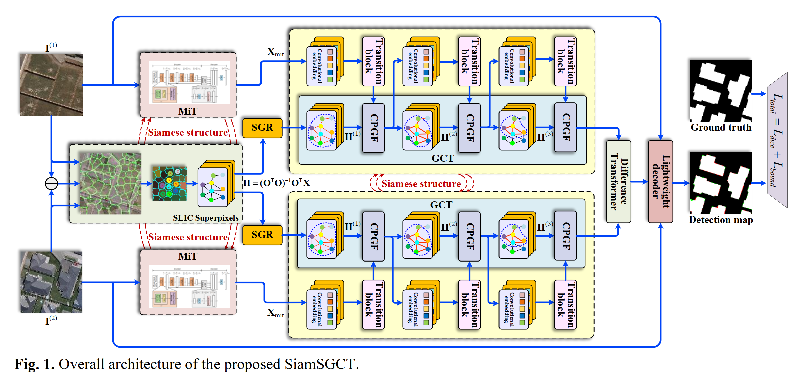

# SiamSGCT

This project implements the SiamSGCT remote sensing image change detection algorithm, which combines a Siamese Transformer backbone with superpixel graph convolution and global attention mechanisms, achieving SOTA-level detection accuracy on the LEVIR-CD dataset.

## Model Architecture


Core model design:
1.  **Siamese MiT-b0 Backbone** - Weight-shared multi-scale vision Transformer feature extractor
2.  **SGCT (SGR+GCT) Superpixel Graph Convolution Module** - Two-stage superpixel graph convolution + Transformer fusion for long-range semantic association
3.  **Cross-Modal Pixel-level Fusion Attention (CPGF)** - Bidirectional alignment and enhancement between graph features and pixel features
4.  **Difference Transformer** - Global context modeling of temporal feature differences

## Environment Dependencies
```
torch >= 1.12
torchvision >= 0.13
torch-geometric >= 2.3
opencv-python
scikit-image
numpy
tqdm
```

## Quick Start

### 1. Dataset Preparation
```
data/
├── LEVIR-CD256/
│   ├── A/          # Time-phase 1 images
│   ├── B/          # Time-phase 2 images  
│   ├── label/      # Change labels
│   └── list/       # Split files directory
│       ├── test.txt
│       ├── train.txt
│       └── val.txt
└── WHU-CD-256/
    ├── A/          # Time-phase 1 images
    ├── B/          # Time-phase 2 images
    ├── label/      # Change labels
    └── list/       # Split files directory
        ├── test.txt
        ├── train.txt
        └── val.txt

```

### 2. Switch Dataset
Switch datasets with one click using the `configs/default.yaml` configuration file:
```yaml
data:
  dataset: 'levir'  # levir / whu
```

### 3. Train Model
```bash
python train.py
```

Default training parameters:
- Batch Size: 32
- Epochs: 150
- Initial Learning Rate: 4e-4
- Optimizer: AdamW

### 4. Evaluate Model
```bash
python evaluate.py --weights siamsgct_best.pth
```

## Performance Metrics
On LEVIR-CD test set:
| Metric  | Value  |
|---------|--------|
| F1      | 92.05  |
| IoU     | 85.27  |
| OA      | 98.73  |
| Precision | 91.56 |
| Recall    | 92.54 |

## Project Structure
```
├── configs/        # Configuration files
│   └── default.yaml
├── datasets/       # Dataset definitions
│   ├── levir_cd.py
│   └── whu_cd.py
├── models/         # Model architectures
│   ├── mit_backbone.py
│   ├── gct_module.py
│   ├── cpgf.py     # CPGF module
│   └── cd_model.py
├── utils/          # Utility functions
│   ├── losses.py
│   └── metrics.py
├── train.py        # Training entry
├── evaluate.py     # Evaluation script
└── README.md
```

## Citation
If this project is helpful for your research, please cite the SiamSGCT related paper.